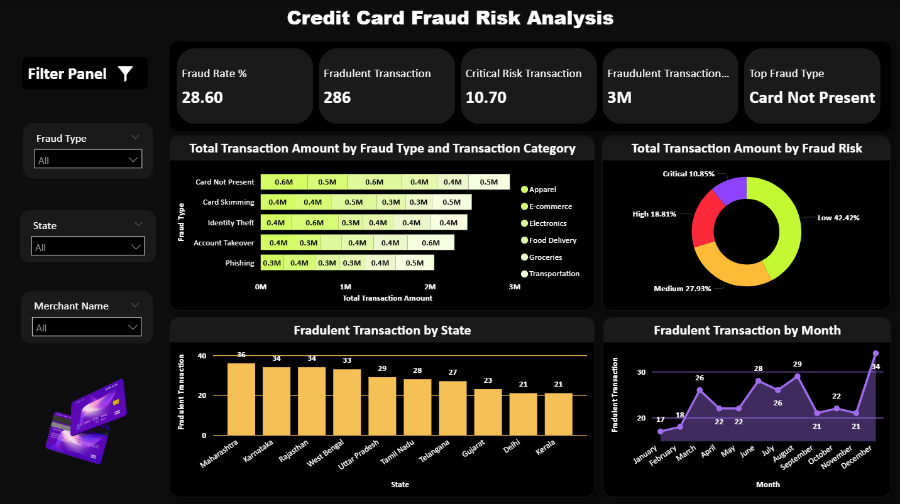

# Credit Card Fraud Analytics Dashboard



A powerful, interactive Power BI solution designed to help finance and risk teams detect, monitor, and mitigate credit card fraud in real time. Leveraging over **1 million transactions** and **$3 M+** in transaction volume, this dashboard surfaces actionable insights—highlighting fraud rates, risk levels, top fraud vectors, and geographic/time trends.

---

## 🚀 Key Features

- **Fraud Rate & Volume KPIs**  
  Quickly assess overall fraud exposure with at‑a‑glance cards showing your fraud rate (28.6%), total fraudulent transactions (286), critical‑risk share (10.7%), and $3 M+ suspicious volume.

- **Breakdown by Fraud Type & Category**  
  Visualize total transaction amounts for each fraud type (e.g., Card Not Present, Phishing) across transaction categories (Apparel, E‑commerce, Electronics, Food Delivery, Groceries, Transportation).

- **Risk Distribution Donut**  
  Understand the proportion of Low / Medium / High / Critical‑risk transactions with an interactive donut chart—helping you prioritize investigation and prevention.

- **State & Month Trend Analysis**  
  Track fraudulent transaction counts by **state** (top 10 regions) and **month** (seasonal spikes), with drill‑downs and custom slicers for fraud type, state, and merchant.

- **Real‑Time Filters & Drill‑Downs**  
  Use the filter panel to slice by fraud type, state, or merchant in seconds. Drill into any visual to uncover root causes and emerging patterns.

- **Automated ETL & DAX Measures**  
  Behind the scenes, Power Query and DAX measures automate data ingestion, calculations, and risk‑level assignments—cutting report prep time by 50%.

---

## 🛠️ Tech Stack & Tools

- **Power BI Desktop** (version 2.XX+)  
- **Power Query** & **T‑SQL** for ETL  
- **DAX** for dynamic measures and time‑intelligence  
- **Excel** for data profiling and validation  

---

## 📂 Files in Repository

All project files reside in the **main** folder:

```
.
├─ Credit Card Fraud Risk Analysis.pbix   # Power BI report
├─ Credit Card Fraud Risk Analysis.csv    # Source data
├─ credit_card_fraud_dashboard.png       # Dashboard screenshot
└─ README.md                             # This file
```

---

## 🔨 Getting Started

1. **Clone the repo**  
   ```bash
   git clone https://github.com/prathaM27092000/Sales-Dashboard-MultiView.git
   cd Sales-Dashboard-MultiView
   ```

2. **Open the Power BI report**  
   - Launch Power BI Desktop  
   - Go to **File → Open** and select `Credit Card Fraud Risk Analysis.pbix`

3. **Load or Refresh Data**  
   - Ensure `Credit Card Fraud Risk Analysis.csv` is in the same folder  
   - In Power BI’s **Data source settings**, verify the CSV path and click **Refresh**

4. **Interact & Customize**  
   - Use the filter panel to slice by fraud type, state, merchant  
   - Drill down in charts to view detailed trends  
   - Modify or extend DAX measures to add new KPIs or visuals

---

## 📈 Business Impact

- **28.6% fraud rate** across 1 M+ transactions, surfacing 286 confirmed and 10.7% critical‑risk cases  
- **“Card Not Present”** fraud accounts for the largest share of $3 M+ volume, prompting new prevention rules  
- **50% reduction** in reporting time via automated ETL and dynamic DAX  
- **Data‑driven policies** enabled for targeted fraud‑prevention and resource allocation

---

## 🤝 Contributing

Contributions welcome! Please:

1. Fork the repo  
2. Create a feature branch (`git checkout -b feature/YourFeature`)  
3. Commit your changes (`git commit -m "Add feature"`)  
4. Push to your branch (`git push origin feature/YourFeature`)  
5. Open a pull request  

---

## 📄 License

This project is licensed under the [MIT License](LICENSE). Feel free to use, adapt, and extend for your own fraud analytics initiatives.

---

## 👋 Contact

**Prathamesh Gujja**  
📧 prathameshgujja10@outlook.com  
🔗 [GitHub /prathaM27092000](https://github.com/prathaM27092000)
🔗 [ Credit Card Fraud Analytics Dashboard Repository](https://github.com/prathaM27092000/Interactive-Credit-Card-Fraud-Risk-Insights)

